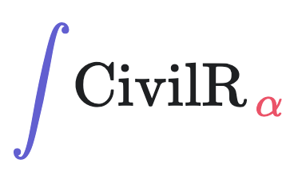

<p align="center"></p>

<h1 align="center"> Open Source Civil Engineering Calculations </h1>

<p align="center"> Intro - xxx </p>

<hr/>

# CivilR

A template of README best practices to make your README simple to understand and easy to use. 

## Table of Contents

- [Installation](#installation)
- [Usage](#usage)
- [Support](#support)
- [Contributing](#contributing)

## Installation

Download to your project directory, add `README.md`, and commit:

```sh
curl -LO http://git.io/Xy0Chg
git add README.md
git commit -m "Use README Boilerplate"
```

## Usage

Replace the contents of `README.md` with your project's:

- Name
- Description
- Installation instructions
- Usage instructions
- Support instructions
- Contributing instructions
- Licence

Feel free to remove any sections that aren't applicable to your project.

## Support

Please [open an issue](https://github.com/shadowboxingskills/civilR/issues/new) for support.

## Contributing

Please contribute using [Github Flow](https://guides.github.com/introduction/flow/). Create a branch, add commits, and [open a pull request](https://github.com/shadowboxingskills/civilR/compare/).

## License

Usage is provided under the MIT License. 
See [LICENSE](https://github.com/shadowboxingskills/civilR/blob/master/LICENSE) for full details.
